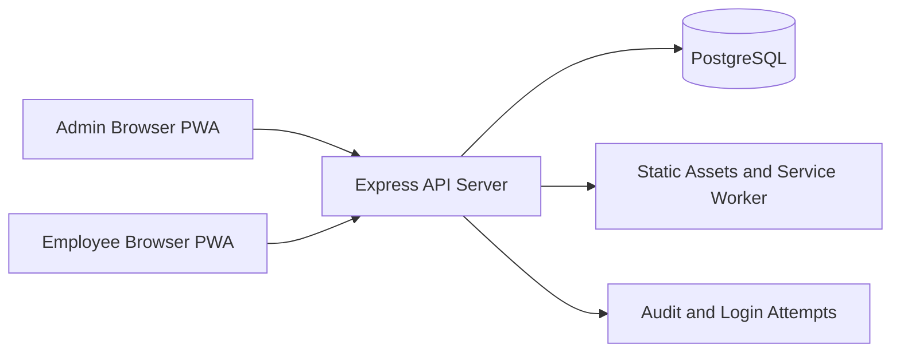

# FuelStation Pro Architecture

## 1. System overview
FuelStation Pro is a multi-tenant fuel station management platform with a single Node.js/Express backend and a plain JavaScript PWA frontend.

Primary goals:
- Run multiple fuel stations (tenants) in one deployment.
- Provide station operations workflows (sales, pumps/readings, tanks, shifts, staff, expenses, credit).
- Support both admin and employee portals.
- Keep data isolated per tenant_id.

## 2. High-level architecture

## 3. Runtime components

### 3.1 Backend
- Runtime: Node.js + Express
- Entry point: src/server.js
- Core modules:
  - src/security.js: authentication middleware, role checks, sanitization, brute-force and session helpers
  - src/auth.js: super/admin/employee auth routes and session endpoints
  - src/data.js: tenant-scoped data CRUD and business routes
  - src/schema.js: PostgreSQL pool, schema bootstrap, migrations, and compatibility wrapper

### 3.2 Frontend (PWA)
- Location: src/public
- Delivery model: static files served by Express
- Key modules:
  - app.js: main admin app orchestration
  - employee.js: employee workflows (login, readings, sales)
  - admin.js: management workflows
  - api-client.js and bridge.js: API integration and compatibility layer
  - sw.js and manifest.json: offline/PWA behavior

### 3.3 Data layer
- Database: PostgreSQL
- Pool managed in src/schema.js
- Schema bootstrap + additive migrations run at startup
- Critical tables include tenants, users/sessions, sales, pumps, tanks, employees, shifts, expenses, purchases, credit ledger, audit logs

## 4. Request and workflow architecture

### 4.1 Authentication and session model
- Super admin login: /api/auth/super-login
- Tenant admin login: /api/auth/login
- Employee PIN login: /api/auth/employee-login
- Session validation: /api/auth/session
- Session storage: sessions table with token + expiration

Role model:
- super
- admin (Owner, Manager, etc.)
- employee

### 4.2 Employee sales flow
1. Employee logs in with PIN.
2. Employee records sale via public endpoint fallback or authenticated flow.
3. Server validates inputs and tenant.
4. Sales write occurs transactionally for credit-sensitive cases.
5. Optional idempotency key prevents duplicate writes on retry.
6. Related aggregates (credit balances, readings) are updated.

### 4.3 Meter/readings and inventory flow
- Pump readings are updated with merge-safe logic.
- Tank levels and dip entries are persisted tenant-wise.
- Day-lock controls can block writes for closed accounting days.

## 5. Data model groups

### 5.1 Identity and tenancy
- super_admin
- tenants
- admin_users
- sessions
- login_attempts

### 5.2 Operations
- sales
- dip_readings
- tanks
- pumps
- shifts
- employees

### 5.3 Financial
- expenses
- fuel_purchases
- credit_customers
- credit_transactions

### 5.4 Product extensions
- lubes_products
- lubes_sales

### 5.5 Governance
- audit_log
- settings

## 6. Security architecture

Security controls currently present:
- Helmet headers + CSP setup.
- CORS policy controlled by environment.
- Global and endpoint-specific rate limiting.
- Input sanitization middleware.
- Session token authentication middleware.
- Role-based authorization checks.
- Brute-force protection on auth routes.
- Parameterized SQL queries.
- Password/PIN hashing with bcrypt support (legacy SHA-256 compatibility path).
- HTTPS redirect in production behind proxy headers.

## 7. Multi-tenant isolation design

Isolation strategy:
- Shared application + shared PostgreSQL database.
- Tenant scoping done through tenant_id on operational tables.
- API middleware populates req.tenantId from session where applicable.
- Tenant-scoped routes are expected to filter every read/write by tenant_id.

Risk to monitor:
- Any new route that omits tenant_id predicate can cause cross-tenant leakage.

## 8. Scalability and reliability characteristics

Existing foundations:
- PostgreSQL connection pooling tuned for production profile.
- Health endpoints for liveness/readiness style checks.
- Write-path transactions in high-risk operations.
- Idempotency keys in selected write flows.
- Caching in frontend bridge for tenant and reference data.

Gaps for larger scale:
- No queue-based retry pipeline for eventual write reconciliation.
- A basic concurrent write load script exists at tests/load/sales-concurrency.js, but no CI-integrated performance baseline yet.
- Backup/restore orchestration is not codified in repo scripts.

## 9. Deployment architecture

Current target:
- Railway deployment with environment-driven configuration.
- Single service process serving API + static PWA assets.
- PostgreSQL managed externally (Railway Postgres).

Expected environment values include:
- DATABASE_URL or PG* vars
- NODE_ENV
- PORT
- CORS_ORIGIN (production CORS behavior)
- SUPER_ADMIN_INIT_PASS and optional SUPER_ADMIN_USERNAME

## 10. Testing architecture

Current automated tests focus on:
- Security middleware behavior
- Auth route behavior
- API health and validation behavior
- Schema/helper logic
- PIN verification compatibility logic
- Concurrent sales write load check script (manual execution)

Test command:
- npm test
- npm run test:load:sales

## 11. Architectural decisions summary

- Chosen data store: PostgreSQL for transactional consistency and reporting.
- Chosen app model: monolithic Express API + static PWA for delivery simplicity.
- Chosen tenancy model: shared database with strict tenant_id partitioning in queries.
- Chosen auth model: token sessions with role-aware middleware.
- Chosen compatibility model: maintain camelCase/snake_case tolerance where already expected by clients.

## 12. Subscription and Billing Architecture

### 12.1 Overview
Subscription and billing functionality is implemented to support multi-tier subscription models for fuel station tenants. The system tracks subscription status, trial periods, paid subscription periods, and payment history in the PostgreSQL database under super admin management.

### 12.2 Core Tables

#### subscriptions table
Stores the subscription state for each tenant:
- `id` (SERIAL PRIMARY KEY): subscription record ID
- `tenant_id` (TEXT, UNIQUE): linked to tenants table
- `plan` (TEXT): subscription tier (e.g., 'trial', 'monthly', 'quarterly', 'half-yearly', 'yearly')
- `status` (TEXT): current status ('trial', 'active', 'expired', 'grace')
- `trial_days` (INTEGER): trial period duration (default: 30 days)
- `trial_start` (TIMESTAMPTZ): start date of trial period
- `sub_start` (TIMESTAMPTZ): paid subscription start date
- `sub_end` (TIMESTAMPTZ): paid subscription end date
- `price_monthly` (REAL): monthly price for the plan
- `grace_days` (INTEGER): grace period after expiry (default: 3 days)
- `owner_phone` (TEXT): station owner contact
- `notes` (TEXT): administrative notes
- `created_at` (TIMESTAMPTZ): record creation timestamp
- `updated_at` (TIMESTAMPTZ): last update timestamp

#### subscription_payments table
Records individual payments and subscription activations:
- `id` (SERIAL PRIMARY KEY): payment record ID
- `tenant_id` (TEXT): linked to tenant
- `plan` (TEXT): plan at time of payment
- `amount` (REAL): payment amount
- `payment_date` (TIMESTAMPTZ): when payment was recorded
- `payment_mode` (TEXT): payment method ('upi', 'bank_transfer', etc.)
- `reference` (TEXT): payment reference/transaction ID
- `months` (INTEGER): subscription duration in months
- `period_start` (TIMESTAMPTZ): coverage start date
- `period_end` (TIMESTAMPTZ): coverage end date
- `recorded_by` (TEXT): super admin who recorded the payment
- `notes` (TEXT): payment notes
- `created_at` (TIMESTAMPTZ): record creation timestamp

### 12.3 API Endpoints

#### Subscription Status
- **GET /api/subscriptions/:tenantId**: Retrieve subscription status for a tenant
  - Accessible by super admin or the tenant itself
  - Returns effective status ('trial', 'active', 'grace', 'expired') and days remaining
  - Auto-creates trial subscription if missing

- **GET /api/subscriptions**: List all subscriptions (super admin only)
  - Returns subscription status for all tenants
  - Joins with payment history for financial summary
  - Auto-creates trial records for any tenant without a subscription

- **GET /api/public/subscription/:tenantId**: Public endpoint for subscription validation
  - Called by tenant on login to check read-only status
  - Returns subscription status without authentication requirement
  - Used to determine if station operations are locked

#### Subscription Management
- **PUT /api/subscriptions/:tenantId**: Update subscription settings (super admin only)
  - Upserts subscription record with plan, status, trial days, pricing, grace period
  - Allows setting subscription start/end dates manually

- **POST /api/subscriptions/:tenantId/payments**: Record a payment and activate/extend subscription
  - Records payment in subscription_payments table
  - Calculates new subscription period (extends from current end if active)
  - Updates subscription status to 'active'
  - Supports multiple months extension

- **GET /api/subscriptions/:tenantId/payments**: Retrieve payment history (super admin only)
  - Returns all payments for a tenant ordered by date descending

### 12.4 Status Computation Logic

The system computes effective subscription status as:
1. **Trial Status**: Active if current date < (trial_start + trial_days), else 'expired'
2. **Active Status**: 
   - 'active' if current date < sub_end
   - 'grace' if current date is between sub_end and (sub_end + grace_days)
   - 'expired' if current date > (sub_end + grace_days)
3. **Read-Only Flag**: Set to true if effective_status = 'expired'

### 12.5 Integration Points

- **Tenant Creation**: New tenants auto-start with 30-day trial subscription
- **Station Login**: Tenant checks public subscription endpoint to determine UI/functionality availability
- **Write Operations**: Expired subscriptions cause is_read_only flag to block new data entry
- **Billing Dashboard**: Super admin panel displays all subscriptions with payment history and effective status

### 12.6 Data Flow
1. New tenant is registered → trial subscription auto-created
2. Station admin operates during trial period (read/write enabled)
3. Super admin records payment via POST /api/subscriptions/:tenantId/payments
4. System calculates subscription period and activates paid plan
5. On expiry, system enters grace period if configured
6. After grace period, system marks subscription as expired and enables read-only mode
7. Tenant can renew by making another payment (extends from current end date)

---

## 13. Oil Marketing Company (OMC) Module Integration

### 13.1 Overview
The OMC module enables fuel station tenants to be linked with specific Oil Marketing Companies (IOCL, BPCL, HPCL, MRPL, or Private). Each OMC has distinct lube product catalogs with pre-configured brands, HSN codes, and GST rates. This integration ensures regulatory compliance and accurate product classification for each fuel brand.

### 13.2 OMC Field in Tenants Table

The `tenants` table includes:
- `omc` (TEXT): Oil Marketing Company code ('iocl', 'bpcl', 'hpcl', 'mrpl', 'private')
- Default value: 'iocl' (ensures backward compatibility)
- Added via safe migration: `ALTER TABLE tenants ADD COLUMN IF NOT EXISTS omc TEXT DEFAULT 'iocl'`

### 13.3 OMC Catalogs and Product Seeding

When a station is created via **POST /api/data/tenants**, the system:
1. Accepts `omc` parameter from super admin
2. Validates OMC against supported values
3. Seeds the `lubes_products` table with OMC-specific product templates

#### Supported OMC Catalogs

**IOCL (Indian Oil)**
- Brand: Indian Oil / Servo
- Products: Servo 2T Supreme, Servo Super 20W-40, Servo Pride TC, Clear Blue Coolant, Servo Gear MP80, Servo Brake Fluid
- HSN: 271019 (Engine oils), 31021000 (Coolants)
- GST: 18%

**BPCL (Bharat Petroleum)**
- Brand: BPCL / MAK
- Products: MAK 2T Extra, MAK Cruise, MAK Activ, MAK Protec, MAK Coolant, MAK Gear EP90, MAK Brake Fluid, MAK Hydraulic
- HSN: 271019 (Oils), 38200000 (Coolants)
- GST: 18%

**HPCL (Hindustan Petroleum)**
- Brand: HPCL / HP Lubricants
- Products: HP 2T Plus, HP Milcy, HP Racer4, HP Coolant, HP Gear EP90, HP Brake Fluid, HP Enklo Hydraulic
- HSN: 271019, 38200000
- GST: 18%

**MRPL (Mangalore Refinery)**
- Brand: MRPL / Apsara
- Products: Apsara 2T, Apsara 4T variants, Apsara Gear Oil, Apsara Hydraulic, Apsara Brake Fluid
- HSN: 271019
- GST: 18%

**Private/Other**
- Configured by station admin on first login
- No pre-seeded products

### 13.4 Tenant Station Creation Flow (Super Admin)

1. **Input**: Super admin selects OMC from dropdown (iocl, bpcl, hpcl, mrpl, private)
2. **Validation**: OMC value is normalized to lowercase and validated
3. **Tenant Creation**: New tenant record created with `omc` field populated
4. **Product Seeding**: Corresponding OMC lube catalog is inserted into `lubes_products`
   - Products inserted with: stock=0, cost_price=0, selling_price=0
   - Station admin sets prices on first login
   - Pre-filled with HSN codes and GST rates
5. **Audit Logging**: Tenant creation logged in `audit_log`

### 13.5 API Endpoints

#### Tenant CRUD Operations
- **GET /api/data/tenants**: Lists all tenants (super admin only)
  - Returns `omc` field for each station
  - Includes fallback logic if `omc` column missing on legacy deployments
  - Default to 'iocl' if `omc` is null

- **POST /api/data/tenants**: Create new tenant with OMC (super admin only)
  - Request body includes: `name`, `location`, `omc`, `adminUser`, `adminPass`
  - OMC field determines which product catalog to seed
  - Auto-seeds 6-19 products based on OMC choice

- **PUT /api/data/tenants/:tenantId**: Update tenant details
  - Can update OMC (note: does not re-seed products)

### 13.6 Frontend Integration

#### Super Admin UI (Add Station)
- "Add Station" modal presents dropdown with OMC options
- Selections: IOCL, BPCL, HPCL, MRPL, Custom/Private
- Display form: Station Name, Location, Owner Name, Phone, OMC, Admin Username, Admin Password
- On successful creation, station appears in stations list with visible OMC indicator

#### Tenant Admin UI (Dashboard)
- Station dashboard displays OMC badge/indicator
- Station profile page shows OMC as read-only field
- Lubes product management pre-populated with OMC-specific products

### 13.7 Data Model Integration

#### lubes_products table
- `id` (TEXT): unique product ID (tenant-scoped)
- `tenant_id` (TEXT): which station owns this product
- `name` (TEXT): product name (from OMC catalog)
- `brand` (TEXT): brand name (e.g., "Indian Oil / Servo")
- `category` (TEXT): product category (Engine Oil, Coolant, Gear Oil, Brake Fluid, Hydraulic Oil)
- `hsn` (TEXT): HSN code for GST filing
- `gst_pct` (REAL): GST percentage (pre-filled from catalog)
- `unit` (TEXT): unit of measure ('L' or 'Nos')
- `selling_price` (REAL): rate per unit (set by station admin)
- `cost_price` (REAL): cost per unit
- `stock` (REAL): current inventory
- `data_json` (TEXT): extended metadata (includes `sku`, `source`, `omc` flag)

### 13.8 Backward Compatibility

- OMC column added as nullable with default 'iocl' (no data loss for existing tenants)
- GET /api/data/tenants includes fallback logic: if OMC column doesn't exist, query is retried without it
- Missing OMC values default to 'iocl' in response payloads
- Existing tenants not affected; their lubes_products remain unchanged

### 13.9 Compliance and Regulatory Integration

- **GST Filing**: EMC products pre-configured with correct HSN codes and GST rates for GSTR-1 exports
- **Tally XML**: OMC and product codes in data_json support Tally XML export workflows
- **Audit Trail**: OMC selection logged at tenant creation for regulatory audit
- **Product Tracking**: Each lube product linked to its source OMC via data_json metadata

---
